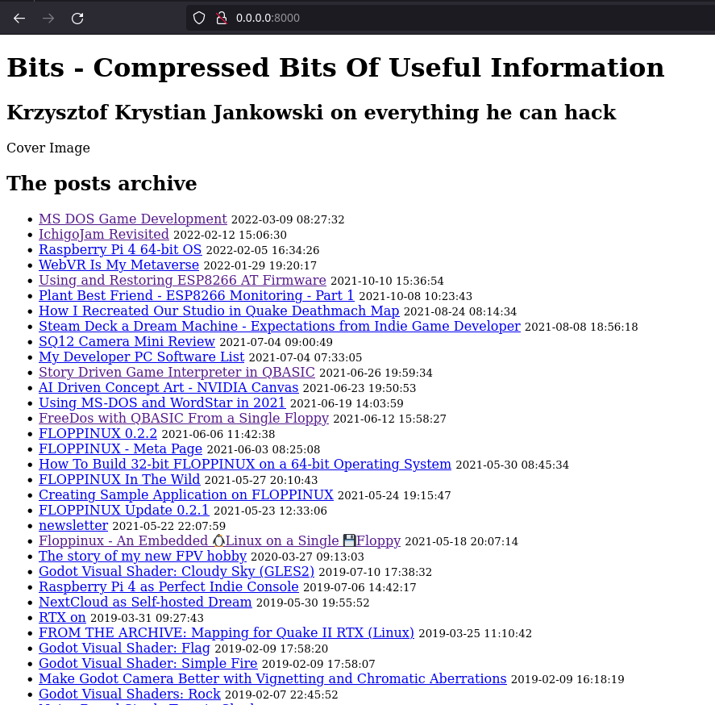
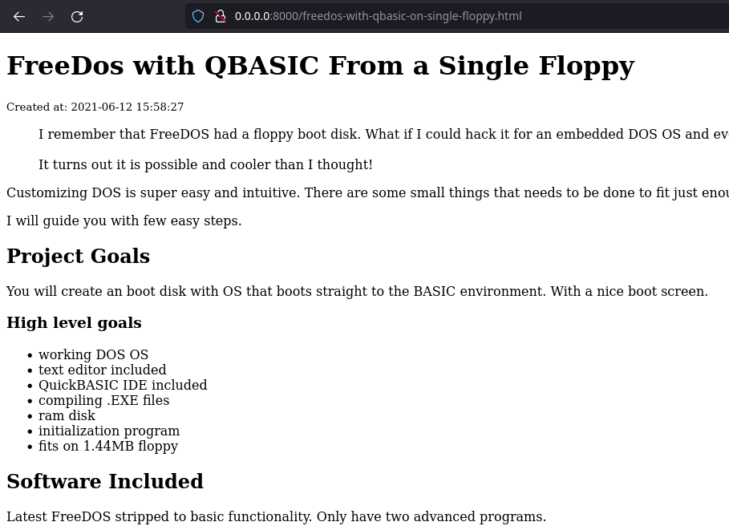

# Ghost Blog Database Extractor

This Python script extracts posts from a Ghost blog SQLite database and generates individual HTML pages for each post. It also creates an index page with a list of links to the extracted posts. The extracted pages can be used for offline browsing or to migrate content to another platform.

## Requirements

- Python 3.x
- SQLite3 library (included in Python standard library)
- Jinja2 library (can be installed via `pip install Jinja2`)

## Usage

1. Ensure you have a backup of your Ghost blog database in SQLite format (`ghost.db`).

2. Place the `ghost.db` in a local directory accessible from the script direcotry.

3. Update `index_template.html` and `page_template.html` to your liking (like copyright in footer!)

3. Open a terminal or command prompt and navigate to the script directory.

4. Run the script with the following command:

```python extract_posts.py ../path/to/ghost.db```

Replace `../path/to/ghost.db` with the actual name of your SQLite database.

5. The script will create an `out` directory (if it doesn't already exist) and generate individual HTML pages for each post inside the `out` directory.

6. It will also generate an `index.html` file in the `out` directory, which contains a list of links to the extracted posts.

7. To preview the generated pages run the following command:

```python -m http.server -d out```

This will start a local web server. Open your web browser and visit `http://localhost:8000` to view the extracted pages.

8. You can customize the HTML templates for individual posts and the index page by modifying the respective template files (`template.html` and `index_template.html`). Make sure to update the script with the correct paths to these template files.

## Example output





## Notes

- Ensure that the necessary images, or any other external assets referenced in the HTML templates are also included in the appropriate directories within the `out` directory for proper rendering.

- The script uses the Jinja2 template engine to render the HTML templates. Please refer to the Jinja2 documentation (https://jinja.palletsprojects.com/) for more information on template syntax and features.

- This script assumes a certain database schema for Ghost blog. If your database schema is different, you may need to modify the script accordingly.

- Always make a backup of your database before running the script to avoid any accidental data loss.

- This script and description was made with a help of ChatGPT. If you are intrested in the process [here is the transcript](https://chat.openai.com/share/ef3da4e1-439e-4459-9528-824c31a09285)
